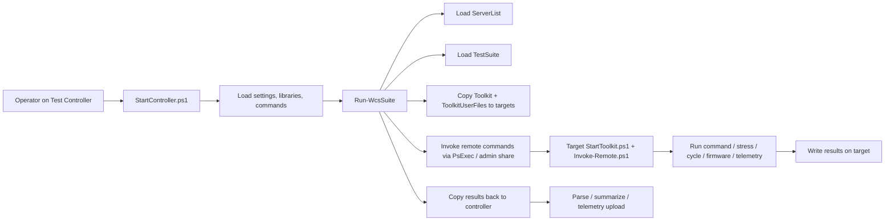

# Frank Toolkit Platform Study

## 1. What This Archive Actually Is

This archive is not a web platform. It is a hardware test automation platform for server qualification.

Its core form is:

- A Windows **Test Controller** running PowerShell orchestration.
- A remote **Toolkit** copied to target machines before test execution.
- A set of **Test Suites** that describe test flows as data-like PowerShell structures.
- A large **binary/tool dependency bundle** used by specific test scenarios.
- A **results collection pipeline** that copies logs back, parses them, and writes summary files.

Observed version:

- `TC.3.11.1`
- Release date in notes: `2021-11-17`

Evidence came primarily from:

- `TestController/StartController.ps1`
- `TestController/Commands/Run-WcsSuite.ps1`
- `TestController/TestSuites/*.ps1`
- `TestControllerUserFiles/ServerLists/*`
- `Toolkit/StartToolkit.ps1`
- `Toolkit/Invoke-Remote.ps1`
- `Toolkit/CodeParts/*/*.json`

## 2. High-Level Architecture

## 3. Main Building Blocks

### 3.1 Controller Layer

The controller boots from `StartController.ps1`.

Responsibilities:

- validates OS and required binaries
- loads controller libraries and commands
- loads user settings
- creates transcript/log directories
- acts as the main operator entrypoint

This is the platform control plane.

### 3.2 Test Suite Layer

Test suites are PowerShell files such as `CP-TestSuite_DC.ps1`.

They behave like a small DSL:

- `TestSuiteDescription`
- `TestCommands = @(...)`
- each command is a hash table with fields like:
  - `Test`
  - `Command`
  - `Type`
  - `Target`
  - `TimeoutInMin`
  - `StopOnFail`
  - `NumberOfCycles`

This is one of the strongest ideas in the whole package: the flow is defined declaratively enough to be reusable.

### 3.3 Inventory Layer

Server inventory is defined separately in `ServerLists`.

Examples show:

- server slot
- address
- host name
- manager type
- manager address
- SSL setting
- optional `PerifSlot`, `G50Slot`, `SOCIp`, `RmkSlot`

This separation between **test definition** and **lab inventory** is correct and worth keeping.

### 3.4 Remote Execution Layer

The controller does not just call local scripts. It:

- copies the toolkit to targets
- executes remote PowerShell through `PsExec`
- uses admin shares like `\\host\\c$`
- collects exit codes from remote runs

Relevant files:

- `Run-WcsSuite.ps1`
- `Copy-WcsFile.ps1`
- `Invoke-WcsCommand.ps1`
- `Copy-WcsRemoteFile.ps1`
- `Invoke-Remote.ps1`

This is the platform execution engine.

### 3.5 Target Toolkit Layer

Each target loads `StartToolkit.ps1`, which:

- detects platform/model
- loads libraries, commands, code parts
- loads product-specific scripts
- loads toolkit settings
- maps file shares
- runs actual test commands

This means the platform is split into:

- controller-side orchestration
- target-side capability runtime

That separation is also worth keeping.

### 3.6 Capability / Plugin Layer

The `Toolkit/CodeParts/*.json` files describe commands in a more structured way.

These JSON files define:

- command name
- version
- summary
- typed inputs
- PowerShell handler entry

This is effectively a plugin metadata layer on top of raw scripts.

It points to a very good product idea:

- keep execution plugins separate from orchestration
- describe capabilities with metadata
- let UI/API discover them dynamically

### 3.7 Artifact and Dependency Layer

This archive is dependency-heavy.

Measured from the zip:

- total files: `5855`
- PowerShell files: `503`
- JSON files: `527`
- EXE files: `434`
- DLL files: `860`

The biggest payload is `ToolkitUserFiles/Binaries`, about `3.8 GB`.

Meaning:

- the platform is not only orchestration
- it is also a packaging/distribution system for many vendor and third-party tools

## 4. What Is Good and Worth Reusing

### 4.1 Good design choices

- controller and target runtime are separated
- test suites are defined independently from inventory
- inventory is model-aware
- commands have common lifecycle behavior
- results are always copied back centrally
- pre/post/monitor hooks exist
- special hardware configs are modeled explicitly
- code parts add metadata above raw scripts

### 4.2 Product insight

The real value is not the UI. The value is:

- inventory management
- test orchestration
- remote execution
- artifact collection
- pluginized hardware actions
- repeatable test plans

If you rebuild this well, the UI can be simple at first.

## 5. What You Should Not Copy Directly

### 5.1 Hardcoded credentials

`DefaultControllerSettings.ps1` and `DefaultToolkitSettings.ps1` contain plaintext credentials.

This is a major security problem.

### 5.2 Heavy coupling to Windows admin shares and PsExec

The platform depends on:

- `PsExec`
- `\\host\\c$`
- file share mapping
- local filesystem conventions like `C:\\Toolkit`

This works in a controlled lab, but it scales poorly and is fragile.

### 5.3 Source of truth is files, not services

Config, suites, inventory, binaries, results, and behavior are mostly file-driven.

That is simple, but weak for:

- auditability
- permissions
- history
- concurrency
- APIs
- multi-user usage

### 5.4 Orchestration and domain logic are mixed together

A lot of hardware-specific knowledge sits directly inside PowerShell orchestration scripts.

That makes the system hard to evolve.

## 6. Recommended Modern Rebuild

If you want to build "a platform like this", do **not** rebuild it as another large PowerShell bundle.

Build it as four products:

### 6.1 Web/API Control Plane

Use:

- `FastAPI` or `.NET 8 Web API`
- `PostgreSQL`
- `Redis` or `RabbitMQ`

Responsibilities:

- projects/labs
- machine inventory
- test plan definitions
- job scheduling
- run history
- artifact indexing
- permissions
- secrets references

### 6.2 Worker / Orchestrator

Use:

- Python worker or .NET background service

Responsibilities:

- expand a test plan into executable steps
- reserve targets
- dispatch actions
- track state
- retry safely
- aggregate results

### 6.3 Target Agent or Protocol Adapters

Preferred order:

1. install a lightweight agent on targets
2. if agents are impossible, use `WinRM`, `SSH`, `Redfish`, `IPMI`
3. use `PsExec` only as a compatibility fallback

Agent responsibilities:

- receive signed jobs
- run steps in sandboxed working dirs
- stream logs
- upload artifacts
- report heartbeat/status

### 6.4 Plugin / Driver System

Do not hardwire all hardware knowledge into the core.

Instead create plugins for:

- BIOS/BMC update
- power cycle
- Redfish actions
- storage tests
- network tests
- FPGA/SOC flows
- telemetry collectors

Each plugin should declare:

- name
- version
- input schema
- target requirements
- expected outputs
- timeout policy

## 7. Suggested Tech Stack

If you want the fastest path with modern maintainability:

- backend: `FastAPI`
- frontend: `Next.js`
- queue: `Redis`
- DB: `PostgreSQL`
- object storage: `MinIO` or `S3`
- agent: `Python` or `Go`
- target command adapters: `PowerShell`, `SSH`, `Redfish`, `IPMI`
- secrets: `Vault`, cloud KMS, or at minimum encrypted DB storage

Why this stack:

- easy to build APIs quickly
- good background job support
- easy JSON schema handling
- good web UI ecosystem
- easy plugin modeling

## 8. Data Model You Should Start With

Core entities:

- `Lab`
- `Target`
- `TargetGroup`
- `CredentialRef`
- `Capability`
- `TestPlan`
- `TestStep`
- `Run`
- `RunStep`
- `Artifact`
- `TelemetrySample`
- `FirmwareBundle`

This is the real platform model. Everything else hangs off this.

## 9. MVP Scope

Do not start with firmware update, FPGA, SOC, telemetry, and all protocols at once.

Build this MVP first:

### Phase 1

- inventory management
- target grouping
- manual command execution on selected targets
- run log capture
- artifact upload and download

### Phase 2

- declarative test plans in YAML or JSON
- step sequencing
- stop on fail
- timeouts
- retry policy
- result summary

### Phase 3

- power-cycle workflows
- Redfish/IPMI adapters
- scheduler
- live dashboard
- alerting

### Phase 4

- plugin marketplace/internal registry
- reusable templates
- richer telemetry
- permissions and audit trail

## 10. How This Maps from the Existing Toolkit

Direct mapping:

- `ServerList` -> `TargetGroup + Target inventory`
- `TestSuite` -> `TestPlan`
- `TestCommand` -> `TestStep`
- `Toolkit command` -> `Capability plugin`
- `Copy toolkit to target` -> `Agent package/version sync`
- `Copy-WcsRemoteFile` -> `Artifact collection`
- `Summary CSV / logs` -> `Run artifacts + structured results`

## 11. My Recommendation

If your goal is a usable internal platform, the right strategy is:

1. keep the **conceptual architecture**
2. replace the **transport and security model**
3. separate **core orchestration** from **hardware plugins**
4. add a **real API + DB + UI**

In one sentence:

This archive is best understood as a strong **automation kernel** wrapped in an outdated **lab execution model**.

## 12. Best Next Step

The next practical step is not "write all features".

It is to scaffold:

- backend API
- run/step data model
- target inventory
- job worker
- plugin interface
- simple web UI

Once that exists, hardware commands can be migrated one by one.

